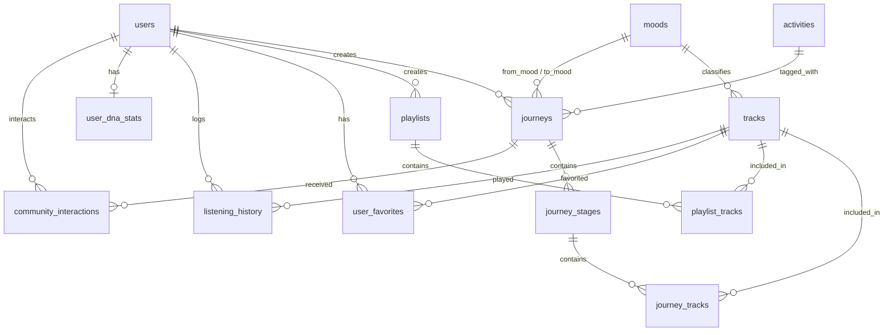

# Thiết Kế Cơ Sở Dữ Liệu MoodFlow (Database Schema Specification)

Tài liệu này mô tả chi tiết kiến trúc và thiết kế Cơ sở dữ liệu (Database Schema) cho ứng dụng **MoodFlow**, đáp ứng đầy đủ các tính năng hiện tại (Auth, Trình phát nhạc, AI Journey, Music DNA, Thống kê, Cộng đồng, Nhạc của tôi) và sẵn sàng tái sử dụng cho việc mở rộng sau này.

---

## 1. Sơ Đồ Quan Hệ Thực Thể (ERD - Entity Relationship Diagram)



---

## 2. Tiêu Chuẩn Thiết Kế Chung (Common Audit Fields)
Tất cả các bảng trong hệ thống nên áp dụng quy ước chung:
- `id`: Khóa chính định danh duy nhất (khuyến nghị dùng `UUID` cho các thực thể người dùng/dữ liệu sinh động và `VARCHAR`/`BIGINT` cho dữ liệu tham chiếu/log).
- `created_at`: Thời điểm khởi tạo bản ghi (`TIMESTAMP WITH TIME ZONE DEFAULT CURRENT_TIMESTAMP`).
- `updated_at`: Thời điểm cập nhật cuối (`TIMESTAMP WITH TIME ZONE DEFAULT CURRENT_TIMESTAMP`).
- `deleted_at`: Thời gian xóa mềm (`NULL` = đang hoạt động; có giá trị = đã xóa mềm).

---

## 3. Danh Sách Chi Tiết Các Bảng

### Bảng 1: `users` (Người dùng & Xác thực)
*Mục đích: Lưu trữ hồ sơ tài khoản, xác thực phân quyền, thiết lập cá nhân.*

| Tên trường | Kiểu dữ liệu | Ràng buộc | Diễn giải & Ứng dụng |
| :--- | :--- | :--- | :--- |
| `id` | `UUID` | **PK**, NOT NULL | Mã định danh duy nhất của người dùng. |
| `email` | `VARCHAR(255)` | UNIQUE, NOT NULL | Địa chỉ email đăng nhập và nhận thông báo. |
| `password_hash` | `VARCHAR(255)` | NOT NULL | Mật khẩu đã được băm (Bcrypt, Argon2). |
| `display_name` | `VARCHAR(100)` | NOT NULL | Tên hiển thị công khai trong ứng dụng. |
| `avatar_url` | `VARCHAR(500)` | NULL | Đường dẫn ảnh đại diện. |
| `bio` | `VARCHAR(255)` | NULL | Lời giới thiệu ngắn cá nhân. |
| `role` | `VARCHAR(20)` | DEFAULT `'user'` | Phân quyền: `'user'`, `'creator'`, `'admin'`. |
| `is_verified` | `BOOLEAN` | DEFAULT `FALSE` | Trạng thái xác thực email/tài khoản. |
| `settings` | `JSONB` / `JSON` | DEFAULT `'{}'` | Cài đặt cá nhân (theme, audio quality, notifications,...). |
| `created_at` | `TIMESTAMPTZ` | DEFAULT NOW() | Ngày tạo tài khoản. |
| `updated_at` | `TIMESTAMPTZ` | DEFAULT NOW() | Ngày cập nhật thông tin gần nhất. |
| `deleted_at` | `TIMESTAMPTZ` | NULL | Dùng cho xóa mềm tài khoản. |

---

### Bảng 2: `moods` (Danh mục Tâm trạng & Cảm xúc)
*Mục đích: Bảng master dữ liệu cảm xúc, cho phép bổ sung tâm trạng mới mà không cần can thiệp code.*

| Tên trường | Kiểu dữ liệu | Ràng buộc | Diễn giải & Ứng dụng |
| :--- | :--- | :--- | :--- |
| `id` | `VARCHAR(50)` | **PK**, NOT NULL | Mã định danh tâm trạng (`anxious`, `calm`, `focus`, `energetic`, `dreamy`, `romantic`, `happy`, `sad`). |
| `label` | `VARCHAR(100)` | NOT NULL | Nhãn hiển thị tiếng Việt (`Căng thẳng`, `Bình tĩnh`, `Tập trung`,...). |
| `emoji` | `VARCHAR(10)` | NOT NULL | Biểu tượng cảm xúc (`😰`, `😌`, `🧠`,...). |
| `colors` | `JSONB` / `JSON` | NOT NULL | Mảng màu Gradient giao diện (VD: `["#6366F1", "#EC4899"]`). |
| `tagline` | `VARCHAR(255)` | NOT NULL | Câu truyền cảm hứng mô tả tâm trạng. |
| `display_order` | `INT` | DEFAULT `0` | Thứ tự ưu tiên sắp xếp trên giao diện. |

---

### Bảng 3: `activities` (Danh mục Hoạt động)
*Mục đích: Bảng master các hoạt động tương ứng khi nghe nhạc.*

| Tên trường | Kiểu dữ liệu | Ràng buộc | Diễn giải & Ứng dụng |
| :--- | :--- | :--- | :--- |
| `id` | `VARCHAR(50)` | **PK**, NOT NULL | Mã hoạt động (`coding`, `study`, `running`, `driving`, `relax`, `work`, `gaming`, `walking`). |
| `label` | `VARCHAR(100)` | NOT NULL | Nhãn tiếng Việt (`Lập trình`, `Học tập`, `Chạy bộ`,...). |
| `icon_name` | `VARCHAR(50)` | NOT NULL | Tên icon hệ thống (`code`, `book`, `footprints`, `car`,...). |
| `display_order` | `INT` | DEFAULT `0` | Thứ tự hiển thị. |

---

### Bảng 4: `tracks` (Kho bài hát & Thuộc tính âm nhạc)
*Mục đích: Lưu trữ metadata bài hát, các chỉ số âm học phục vụ AI Journey và Music DNA.*

| Tên trường | Kiểu dữ liệu | Ràng buộc | Diễn giải & Ứng dụng |
| :--- | :--- | :--- | :--- |
| `id` | `UUID` | **PK**, NOT NULL | Mã bài hát duy nhất. |
| `title` | `VARCHAR(255)` | NOT NULL | Tiêu đề bài hát. |
| `artist` | `VARCHAR(255)` | NOT NULL | Tên nghệ sĩ hoặc nhóm sản xuất. |
| `genre` | `VARCHAR(50)` | NOT NULL | Thể loại (Lofi, R&B, Ambient, Instrumental, Pop,...). |
| `duration` | `INT` | NOT NULL | Độ dài bài hát tính theo **giây** (dễ định dạng `mm:ss`). |
| `cover_url` | `VARCHAR(500)` | NOT NULL | Đường link ảnh bìa bài hát. |
| `audio_url` | `VARCHAR(500)` | NOT NULL | Đường link file stream audio (MP3, AAC,...). |
| `energy` | `INT` | DEFAULT `50` | Mức năng lượng bài hát (thang điểm 0 - 100). |
| `tempo_bpm` | `INT` | NULL | Nhịp độ bài hát (Beats Per Minute). |
| `acousticness` | `FLOAT` | DEFAULT `0.5` | Độ mộc của nhạc (0.0: nhạc điện tử hoàn toàn -> 1.0: âm thanh mộc). |
| `primary_mood_id` | `VARCHAR(50)` | **FK** -> `moods.id` | Cảm xúc phù hợp nhất của bài hát. |
| `pool_key` | `VARCHAR(50)` | NOT NULL | Nhóm phân bổ Journey (`calmdown`, `focus`, `deepfocus`, `cooldown`, `energize`, `romantic`). |
| `lyrics` | `TEXT` | NULL | Lời bài hát. |
| `play_count` | `BIGINT` | DEFAULT `0` | Tổng lượt nghe trên toàn hệ thống. |
| `created_at` | `TIMESTAMPTZ` | DEFAULT NOW() | Thời gian phát hành / đưa lên hệ thống. |

---

### Bảng 5: `journeys` (Hành trình âm nhạc theo cảm xúc)
*Mục đích: Lưu lộ trình âm nhạc chuyển đổi cảm xúc từ trạng thái A sang trạng thái B do người dùng hoặc AI tạo ra.*

| Tên trường | Kiểu dữ liệu | Ràng buộc | Diễn giải & Ứng dụng |
| :--- | :--- | :--- | :--- |
| `id` | `UUID` | **PK**, NOT NULL | Mã hành trình. |
| `user_id` | `UUID` | **FK** -> `users.id` | Người tạo hành trình. |
| `title` | `VARCHAR(255)` | NOT NULL | Tên hành trình (VD: *"2 Hour Coding Flow"*). |
| `description` | `TEXT` | NULL | Mô tả chi tiết hành trình. |
| `from_mood_id` | `VARCHAR(50)` | **FK** -> `moods.id` | Cảm xúc khởi đầu (VD: `anxious`). |
| `to_mood_id` | `VARCHAR(50)` | **FK** -> `moods.id` | Cảm xúc đích đến (VD: `focus`). |
| `activity_id` | `VARCHAR(50)` | **FK** -> `activities.id` | Hoạt động áp dụng (VD: `coding`). |
| `target_duration_mins` | `INT` | NOT NULL | Tổng thời gian dự kiến (phút, VD: 15, 30, 60, 120). |
| `prompt_source` | `TEXT` | NULL | Câu prompt gốc người dùng đã nhập nếu sinh bằng AI Assistant. |
| `is_public` | `BOOLEAN` | DEFAULT `FALSE` | Chia sẻ công khai lên trang Cộng đồng (`TRUE` / `FALSE`). |
| `saves_count` | `INT` | DEFAULT `0` | Tổng số lượt người khác đã lưu journey này. |
| `created_at` | `TIMESTAMPTZ` | DEFAULT NOW() | Thời điểm khởi tạo. |

---

### Bảng 6: `journey_stages` (Các chặng trong hành trình)
*Mục đích: Chia nhỏ một Journey thành nhiều chặng cảm xúc (Calm Down -> Focus -> Deep Focus -> Cool Down).*

| Tên trường | Kiểu dữ liệu | Ràng buộc | Diễn giải & Ứng dụng |
| :--- | :--- | :--- | :--- |
| `id` | `UUID` | **PK**, NOT NULL | Mã chặng. |
| `journey_id` | `UUID` | **FK** -> `journeys.id` | Thuộc hành trình nào (ON DELETE CASCADE). |
| `stage_order` | `INT` | NOT NULL | Thứ tự chặng trong journey (1, 2, 3,...). |
| `stage_title` | `VARCHAR(100)` | NOT NULL | Tên chặng (VD: *Calm Down, Focus, Deep Focus, Cool Down*). |
| `stage_emoji` | `VARCHAR(10)` | NOT NULL | Biểu tượng của chặng (`🌿`, `🎧`, `🧠`, `✨`). |
| `time_share` | `FLOAT` | NOT NULL | Tỷ lệ thời gian của chặng (VD: 0.16, 0.42, 0.30, 0.12). |

---

### Bảng 7: `journey_tracks` (Chi tiết bài hát trong từng chặng)
*Mục đích: Bảng nối liên kết bài hát và thứ tự phát trong mỗi chặng.*

| Tên trường | Kiểu dữ liệu | Ràng buộc | Diễn giải & Ứng dụng |
| :--- | :--- | :--- | :--- |
| `id` | `UUID` | **PK**, NOT NULL | Mã bản ghi. |
| `journey_stage_id` | `UUID` | **FK** -> `journey_stages.id` | Thuộc chặng nào (ON DELETE CASCADE). |
| `track_id` | `UUID` | **FK** -> `tracks.id` | Bài hát được xếp vào chặng. |
| `track_order` | `INT` | NOT NULL | Thứ tự phát trong chặng. |
| `transition_reason` | `VARCHAR(255)` | NULL | Lý do thuật toán xếp bài này (VD: *"Nằm trong Music DNA của bạn"*). |

---

### Bảng 8: `playlists` (Danh sách phát của người dùng)
*Mục đích: Danh sách phát nhạc tùy chỉnh tạo bởi người dùng (Tab "Nhạc của tôi").*

| Tên trường | Kiểu dữ liệu | Ràng buộc | Diễn giải & Ứng dụng |
| :--- | :--- | :--- | :--- |
| `id` | `UUID` | **PK**, NOT NULL | Mã playlist. |
| `user_id` | `UUID` | **FK** -> `users.id` | Người sở hữu playlist. |
| `title` | `VARCHAR(255)` | NOT NULL | Tên playlist. |
| `cover_url` | `VARCHAR(500)` | NULL | Ảnh đại diện playlist. |
| `is_public` | `BOOLEAN` | DEFAULT `FALSE` | Trạng thái công khai. |
| `created_at` | `TIMESTAMPTZ` | DEFAULT NOW() | Thời gian tạo. |

---

### Bảng 9: `playlist_tracks` (Bài hát trong playlist)
*Mục đích: Bảng nối giữa Playlist và Track.*

| Tên trường | Kiểu dữ liệu | Ràng buộc | Diễn giải & Ứng dụng |
| :--- | :--- | :--- | :--- |
| `playlist_id` | `UUID` | **FK** -> `playlists.id` | Khóa ngoại tới Playlist (ON DELETE CASCADE). |
| `track_id` | `UUID` | **FK** -> `tracks.id` | Khóa ngoại tới Track. |
| `position` | `INT` | NOT NULL | Vị trí thứ tự bài trong playlist. |
| `added_at` | `TIMESTAMPTZ` | DEFAULT NOW() | Thời điểm thêm vào playlist. |
| **PK** | `(playlist_id, track_id)` | Khóa chính phức hợp | Một bài hát không bị trùng lặp vị trí trong 1 playlist. |

---

### Bảng 10: `user_favorites` (Bài hát yêu thích & Đã lưu)
*Mục đích: Quản lý "Bài hát đã thích" (Liked) và "Bài hát đã lưu" (Saved) trong tab My Music.*

| Tên trường | Kiểu dữ liệu | Ràng buộc | Diễn giải & Ứng dụng |
| :--- | :--- | :--- | :--- |
| `user_id` | `UUID` | **FK** -> `users.id` | Người thực hiện hành động. |
| `track_id` | `UUID` | **FK** -> `tracks.id` | Bài hát được thích/lưu. |
| `favorite_type` | `VARCHAR(20)` | NOT NULL | Loại tương tác: `'liked'` (thích) hoặc `'saved'` (lưu). |
| `created_at` | `TIMESTAMPTZ` | DEFAULT NOW() | Thời gian thao tác. |
| **PK** | `(user_id, track_id, favorite_type)` | Khóa chính phức hợp | Đảm bảo tính duy nhất của thao tác. |

---

### Bảng 11: `listening_history` (Nhật ký & Lịch sử nghe nhạc)
*Mục đích: Lưu lại toàn bộ lịch sử nghe thực tế. Đây là nguồn dữ liệu để tính toán Thống kê (Statistics) và Music DNA.*

| Tên trường | Kiểu dữ liệu | Ràng buộc | Diễn giải & Ứng dụng |
| :--- | :--- | :--- | :--- |
| `id` | `BIGSERIAL` / `BIGINT` | **PK**, NOT NULL | Mã nhật ký tự tăng. |
| `user_id` | `UUID` | **FK** -> `users.id` | Người nghe. |
| `track_id` | `UUID` | **FK** -> `tracks.id` | Bài hát đã nghe. |
| `journey_id` | `UUID` | **FK** -> `journeys.id` (NULL) | Thuộc Journey nào (nếu nghe lẻ thì để `NULL`). |
| `listened_seconds` | `INT` | NOT NULL | Số giây thực tế người dùng đã nghe. |
| `completed` | `BOOLEAN` | DEFAULT `FALSE` | Đã nghe trọn vẹn bài / journey hay bỏ dở giữa chừng (tính Completion Rate). |
| `played_at` | `TIMESTAMPTZ` | DEFAULT NOW() | Thời điểm nghe (dùng để vẽ biểu đồ theo khung giờ 06h, 09h,... 24h và theo thứ trong tuần). |

---

### Bảng 12: `user_dna_stats` (Chỉ số Music DNA tổng hợp)
*Mục đích: Lưu trữ dữ liệu phân tích định kỳ gu âm nhạc của người dùng (vẽ Radar chart, Donut chart, Slider Energy/Tempo).*

| Tên trường | Kiểu dữ liệu | Ràng buộc | Diễn giải & Ứng dụng |
| :--- | :--- | :--- | :--- |
| `user_id` | `UUID` | **PK**, **FK** -> `users.id` | Mỗi user có duy nhất 1 bản ghi DNA tổng hợp. |
| `total_listening_seconds` | `BIGINT` | DEFAULT `0` | Tổng thời gian nghe (quy đổi ra "128 giờ"). |
| `top_genre` | `VARCHAR(50)` | NULL | Thể loại nghe nhiều nhất (VD: `'R&B'`). |
| `top_artist` | `VARCHAR(100)` | NULL | Nghệ sĩ nghe nhiều nhất (VD: `'Halden'`). |
| `top_mood_id` | `VARCHAR(50)` | **FK** -> `moods.id` | Mood hay nghe nhất (VD: `'focus'`). |
| `genre_distribution` | `JSONB` / `JSON` | NOT NULL | Tỷ lệ thể loại vẽ Donut chart: `[{"genre":"R&B","value":42},{"genre":"Pop","value":28},...]`. |
| `average_energy` | `INT` | DEFAULT `50` | Điểm Energy trung bình (0 - 100) trên DNA Slider. |
| `average_tempo` | `INT` | DEFAULT `50` | Điểm Tempo trung bình (0 - 100) trên DNA Slider. |
| `completion_rate` | `INT` | DEFAULT `0` | Tỷ lệ hoàn thành Journey (VD: `76%`). |
| `updated_at` | `TIMESTAMPTZ` | DEFAULT NOW() | Thời điểm hệ thống cập nhật lại chỉ số. |

---

### Bảng 13: `community_interactions` (Tương tác Cộng đồng)
*Mục đích: Lưu các lượt Lưu (Save), Thích (Like), hoặc Sao chép (Clone) các Music Journey trên trang Cộng đồng.*

| Tên trường | Kiểu dữ liệu | Ràng buộc | Diễn giải & Ứng dụng |
| :--- | :--- | :--- | :--- |
| `id` | `UUID` | **PK**, NOT NULL | Mã tương tác. |
| `user_id` | `UUID` | **FK** -> `users.id` | Người tương tác. |
| `journey_id` | `UUID` | **FK** -> `journeys.id` | Journey được tương tác (ON DELETE CASCADE). |
| `interaction_type` | `VARCHAR(20)` | NOT NULL | Loại tương tác: `'save'`, `'like'`, `'clone'`. |
| `created_at` | `TIMESTAMPTZ` | DEFAULT NOW() | Thời điểm tương tác. |
| **UNIQUE** | `(user_id, journey_id, interaction_type)` | Không trùng lặp | Một user không thể lưu 1 journey nhiều lần. |

---

## 4. Các Chỉ Mục Được Đề Xuất (Recommended Indexes)

Để ứng dụng đạt hiệu năng cao khi mở rộng hàng triệu bản ghi, các Index sau cần được khởi tạo:

1. **`tracks`**:
   - `CREATE INDEX idx_tracks_genre ON tracks(genre);`
   - `CREATE INDEX idx_tracks_pool_key ON tracks(pool_key);`
   - `CREATE INDEX idx_tracks_energy ON tracks(energy);`
2. **`listening_history`**:
   - `CREATE INDEX idx_history_user_played ON listening_history(user_id, played_at DESC);`
   - `CREATE INDEX idx_history_track ON listening_history(track_id);`
3. **`journeys`**:
   - `CREATE INDEX idx_journeys_user ON journeys(user_id);`
   - `CREATE INDEX idx_journeys_public ON journeys(is_public) WHERE is_public = TRUE;`
4. **`user_favorites`**:
   - `CREATE INDEX idx_fav_user_type ON user_favorites(user_id, favorite_type);`

---

## 5. Script DDL Mẫu (PostgreSQL / Supabase Ready)

```sql
-- Kích hoạt extension sinh UUID
CREATE EXTENSION IF NOT EXISTS "uuid-ossp";

-- 1. Bảng Users
CREATE TABLE users (
    id UUID PRIMARY KEY DEFAULT uuid_generate_v4(),
    email VARCHAR(255) UNIQUE NOT NULL,
    password_hash VARCHAR(255) NOT NULL,
    display_name VARCHAR(100) NOT NULL,
    avatar_url VARCHAR(500),
    bio VARCHAR(255),
    role VARCHAR(20) DEFAULT 'user',
    is_verified BOOLEAN DEFAULT FALSE,
    settings JSONB DEFAULT '{}',
    created_at TIMESTAMPTZ DEFAULT CURRENT_TIMESTAMP,
    updated_at TIMESTAMPTZ DEFAULT CURRENT_TIMESTAMP,
    deleted_at TIMESTAMPTZ NULL
);

-- 2. Bảng Moods
CREATE TABLE moods (
    id VARCHAR(50) PRIMARY KEY,
    label VARCHAR(100) NOT NULL,
    emoji VARCHAR(10) NOT NULL,
    colors JSONB NOT NULL,
    tagline VARCHAR(255) NOT NULL,
    display_order INT DEFAULT 0
);

-- 3. Bảng Activities
CREATE TABLE activities (
    id VARCHAR(50) PRIMARY KEY,
    label VARCHAR(100) NOT NULL,
    icon_name VARCHAR(50) NOT NULL,
    display_order INT DEFAULT 0
);

-- 4. Bảng Tracks
CREATE TABLE tracks (
    id UUID PRIMARY KEY DEFAULT uuid_generate_v4(),
    title VARCHAR(255) NOT NULL,
    artist VARCHAR(255) NOT NULL,
    genre VARCHAR(50) NOT NULL,
    duration INT NOT NULL,
    cover_url VARCHAR(500) NOT NULL,
    audio_url VARCHAR(500) NOT NULL,
    energy INT DEFAULT 50,
    tempo_bpm INT NULL,
    acousticness FLOAT DEFAULT 0.5,
    primary_mood_id VARCHAR(50) REFERENCES moods(id),
    pool_key VARCHAR(50) NOT NULL,
    lyrics TEXT NULL,
    play_count BIGINT DEFAULT 0,
    created_at TIMESTAMPTZ DEFAULT CURRENT_TIMESTAMP
);

-- 5. Bảng Journeys
CREATE TABLE journeys (
    id UUID PRIMARY KEY DEFAULT uuid_generate_v4(),
    user_id UUID REFERENCES users(id) ON DELETE CASCADE,
    title VARCHAR(255) NOT NULL,
    description TEXT NULL,
    from_mood_id VARCHAR(50) REFERENCES moods(id),
    to_mood_id VARCHAR(50) REFERENCES moods(id),
    activity_id VARCHAR(50) REFERENCES activities(id),
    target_duration_mins INT NOT NULL,
    prompt_source TEXT NULL,
    is_public BOOLEAN DEFAULT FALSE,
    saves_count INT DEFAULT 0,
    created_at TIMESTAMPTZ DEFAULT CURRENT_TIMESTAMP
);

-- 6. Bảng Journey Stages
CREATE TABLE journey_stages (
    id UUID PRIMARY KEY DEFAULT uuid_generate_v4(),
    journey_id UUID REFERENCES journeys(id) ON DELETE CASCADE,
    stage_order INT NOT NULL,
    stage_title VARCHAR(100) NOT NULL,
    stage_emoji VARCHAR(10) NOT NULL,
    time_share FLOAT NOT NULL
);

-- 7. Bảng Journey Tracks
CREATE TABLE journey_tracks (
    id UUID PRIMARY KEY DEFAULT uuid_generate_v4(),
    journey_stage_id UUID REFERENCES journey_stages(id) ON DELETE CASCADE,
    track_id UUID REFERENCES tracks(id) ON DELETE RESTRICT,
    track_order INT NOT NULL,
    transition_reason VARCHAR(255) NULL
);

-- 8. Bảng Playlists
CREATE TABLE playlists (
    id UUID PRIMARY KEY DEFAULT uuid_generate_v4(),
    user_id UUID REFERENCES users(id) ON DELETE CASCADE,
    title VARCHAR(255) NOT NULL,
    cover_url VARCHAR(500),
    is_public BOOLEAN DEFAULT FALSE,
    created_at TIMESTAMPTZ DEFAULT CURRENT_TIMESTAMP
);

-- 9. Bảng Playlist Tracks
CREATE TABLE playlist_tracks (
    playlist_id UUID REFERENCES playlists(id) ON DELETE CASCADE,
    track_id UUID REFERENCES tracks(id) ON DELETE CASCADE,
    position INT NOT NULL,
    added_at TIMESTAMPTZ DEFAULT CURRENT_TIMESTAMP,
    PRIMARY KEY (playlist_id, track_id)
);

-- 10. Bảng User Favorites
CREATE TABLE user_favorites (
    user_id UUID REFERENCES users(id) ON DELETE CASCADE,
    track_id UUID REFERENCES tracks(id) ON DELETE CASCADE,
    favorite_type VARCHAR(20) NOT NULL,
    created_at TIMESTAMPTZ DEFAULT CURRENT_TIMESTAMP,
    PRIMARY KEY (user_id, track_id, favorite_type)
);

-- 11. Bảng Listening History
CREATE TABLE listening_history (
    id BIGSERIAL PRIMARY KEY,
    user_id UUID REFERENCES users(id) ON DELETE CASCADE,
    track_id UUID REFERENCES tracks(id) ON DELETE CASCADE,
    journey_id UUID REFERENCES journeys(id) ON DELETE SET NULL,
    listened_seconds INT NOT NULL,
    completed BOOLEAN DEFAULT FALSE,
    played_at TIMESTAMPTZ DEFAULT CURRENT_TIMESTAMP
);

-- 12. Bảng User DNA Stats
CREATE TABLE user_dna_stats (
    user_id UUID PRIMARY KEY REFERENCES users(id) ON DELETE CASCADE,
    total_listening_seconds BIGINT DEFAULT 0,
    top_genre VARCHAR(50),
    top_artist VARCHAR(100),
    top_mood_id VARCHAR(50) REFERENCES moods(id),
    genre_distribution JSONB NOT NULL DEFAULT '[]',
    average_energy INT DEFAULT 50,
    average_tempo INT DEFAULT 50,
    completion_rate INT DEFAULT 0,
    updated_at TIMESTAMPTZ DEFAULT CURRENT_TIMESTAMP
);

-- 13. Bảng Community Interactions
CREATE TABLE community_interactions (
    id UUID PRIMARY KEY DEFAULT uuid_generate_v4(),
    user_id UUID REFERENCES users(id) ON DELETE CASCADE,
    journey_id UUID REFERENCES journeys(id) ON DELETE CASCADE,
    interaction_type VARCHAR(20) NOT NULL,
    created_at TIMESTAMPTZ DEFAULT CURRENT_TIMESTAMP,
    UNIQUE (user_id, journey_id, interaction_type)
);
```
